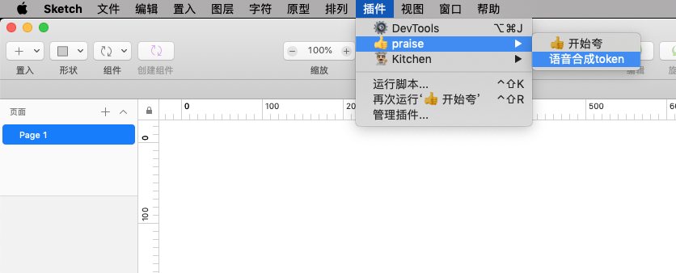

# 👍 praise

Sketch夸夸 —— 用于在设计中夸奖自己

(使用演示视频在images/02.mp4)

[文章链接](https://zhuanlan.zhihu.com/p/63101733)

## 安装

[下载链接](https://github.com/youya-fy/praise/releases/latest)

下载后解压安装

## 使用方法

1. 先在菜单中设置[百度语音合成API](http://ai.baidu.com/tech/speech/tts)的token（默认的token大概5月份就过期了，所以务必每30天更新一次，否则不能使用）

2. 然后打开“开始夸”窗口，输入夸奖语句。

3. 之后只需保持窗口不关闭，在你操作Sketch时，就会不停播放夸奖的语音鼓励你。